# Fully Connected Neural Network using Numpy & Calculus

I developed this feedforward neural network class entirely from scratch, without using machine learning libraries, performing the propagation equations manually using calculus fundamentals.
This network features customizable architecture and training options, and a hyperparameter optimization script for automatically fine tuning network parameters.

Key features of the implementation include support for ReLU, Sigmoid, and Leaky ReLU activation functions, a cross-entropy loss function for classification tasks, and initialization methods such as Xavier, He, and Numpy rand.
The training process includes options for mini-batch training with customizable batch size and real-time plots of training loss, validation loss, and accuracy, and single and grid predictions on unseen data.

## Design Notes

### Data & Network Structure

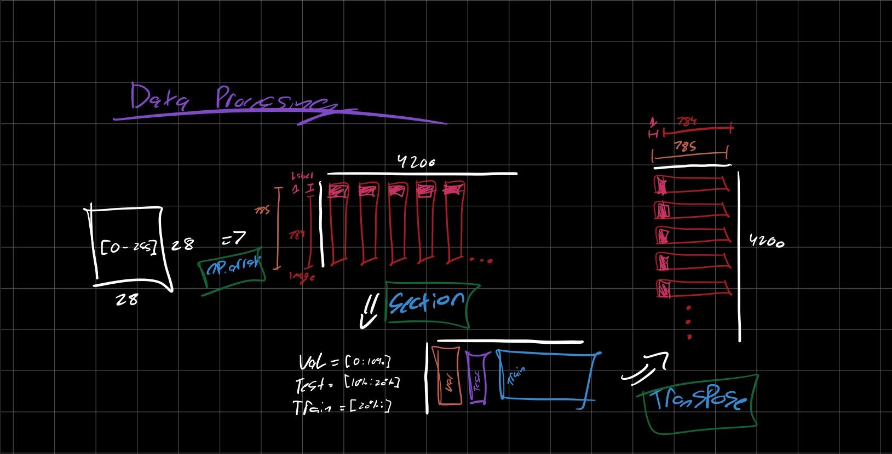
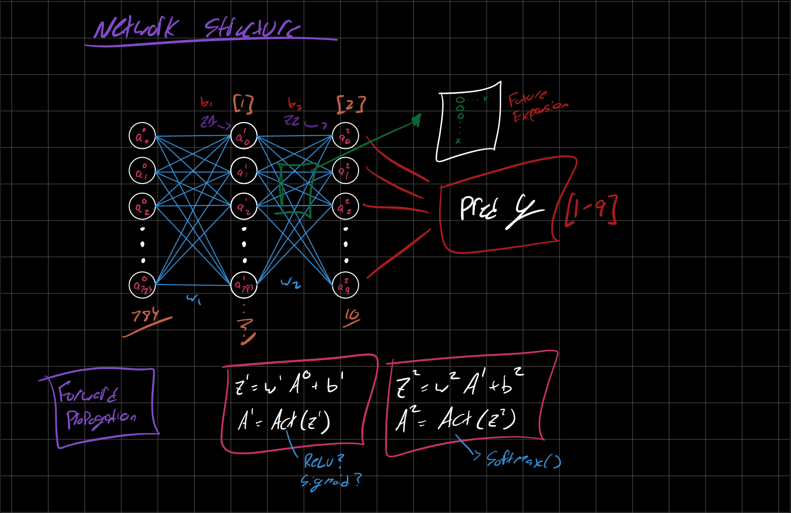

### Propagation Equations

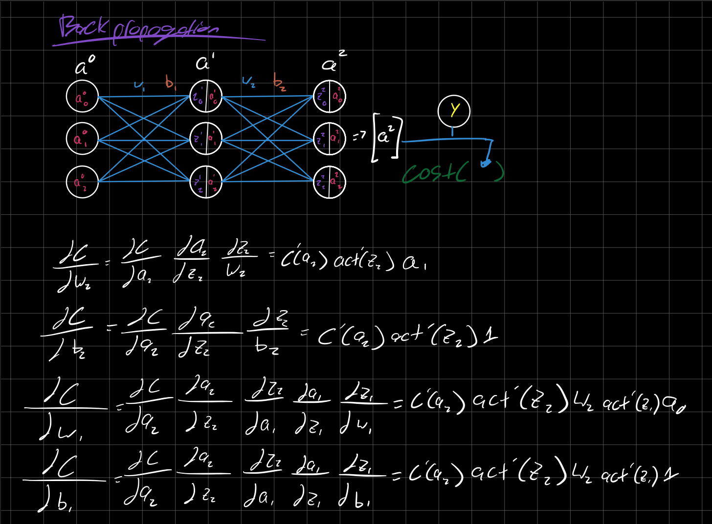
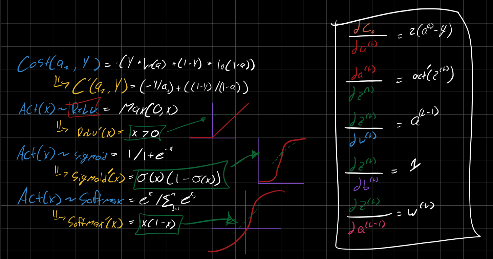
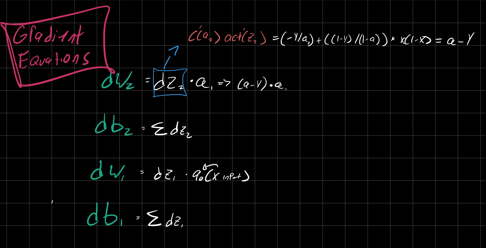

### Optimization

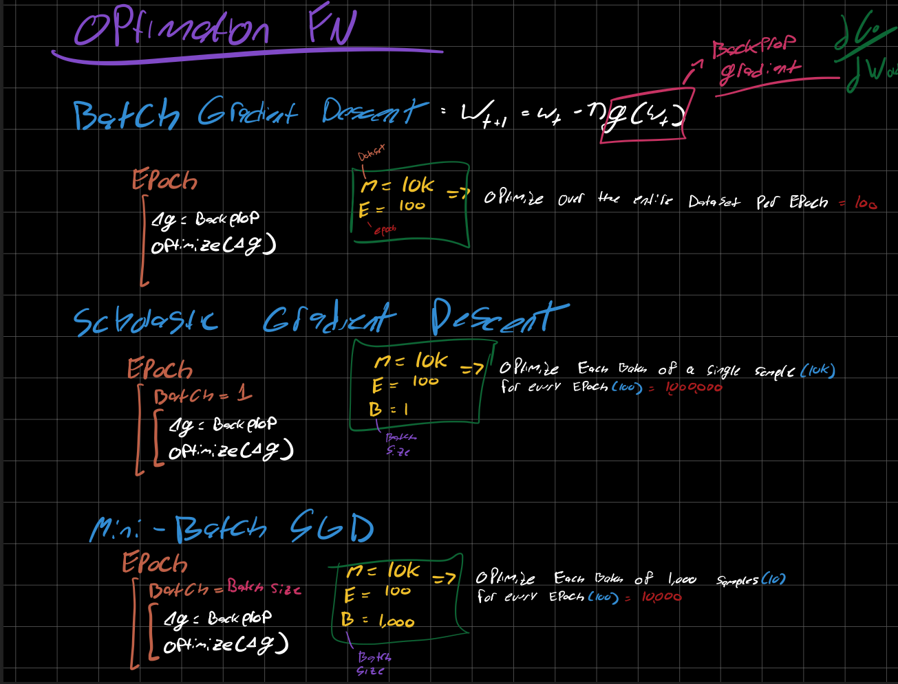

### Hyperparameters

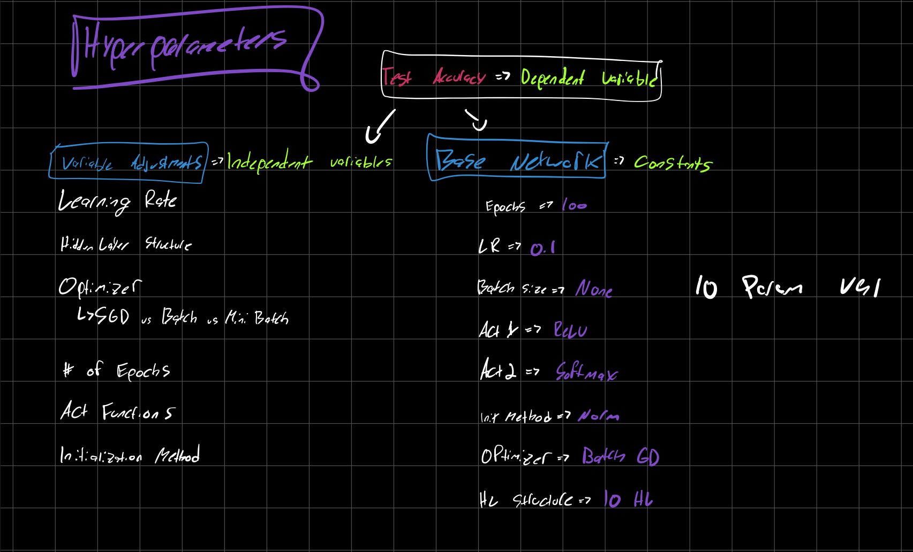
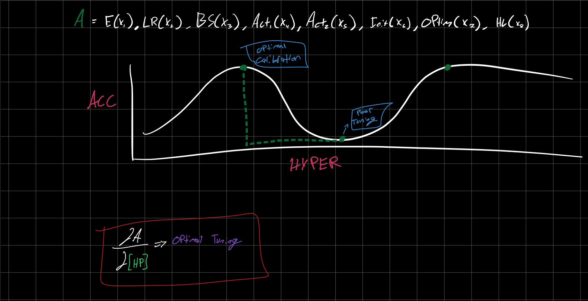

### Results

Additionally, this project includes a hyperparameter optimization script to optimize and plot hyperparameters such as hidden layer neurons, learning rate, activation function, initialization method, and batch size.

<div style="display: flex; flex-wrap: wrap; gap: 10px;">
  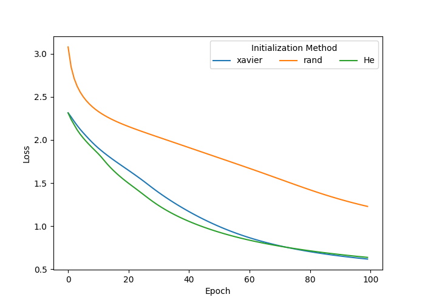
  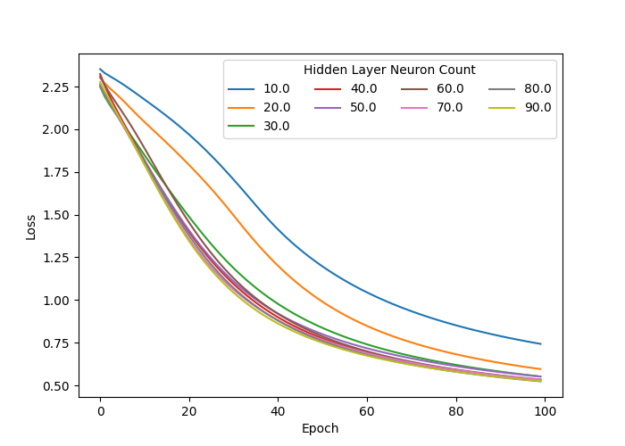
  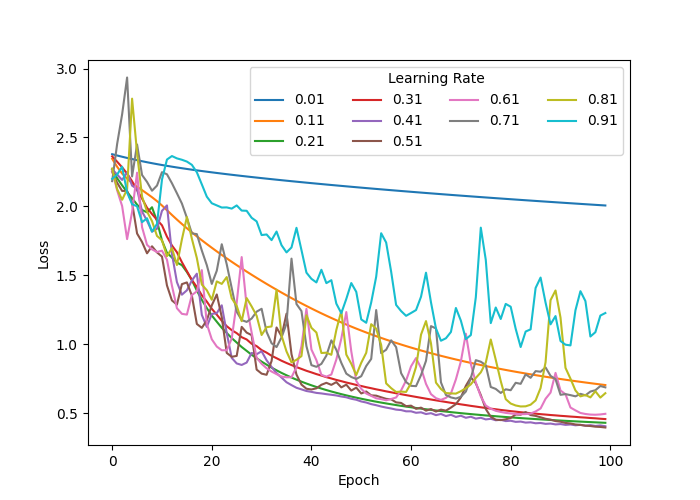
  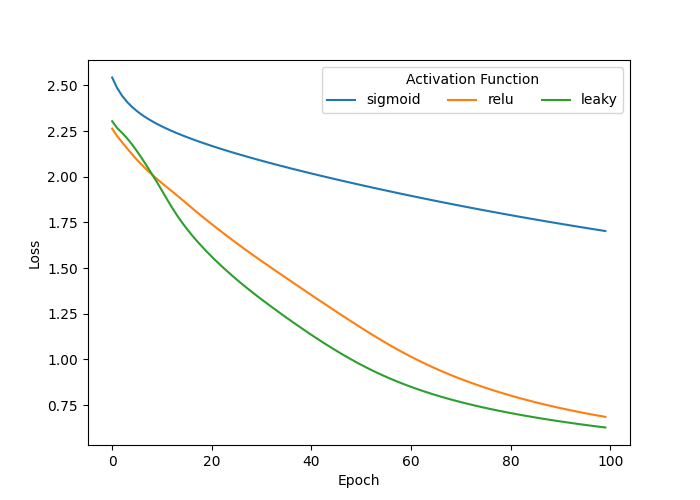
  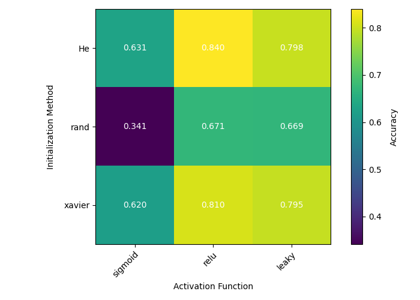
  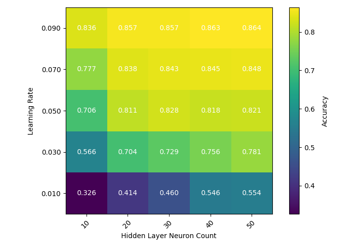
</div>

### Installation

1. Clone the repository:

   ```bash
   git clone https://github.com/josephjquinn/nnScratch
   ```

2. Install dependencies:

   ```bash
   pip install -r requirements.txt
   ```

#### Usage

- `nn.py` Contains network class
- `data.py` Contains data loader class
- `loss.py` Contains loss functions
- `activation.py` Contains activation functions
- `main.py` Training script
- `hyper.py` Calculates and saves optimal hyperparameters
